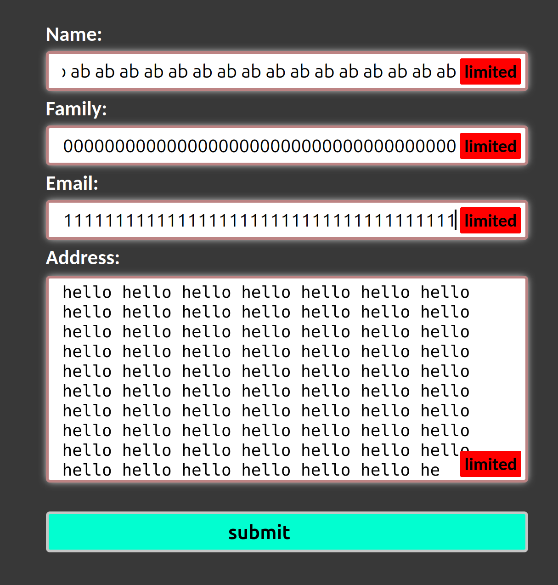

# Form Input and Textarea Character Limit

Enhance your forms with character limit functionality for input fields and textareas. This JavaScript code provides visual alerts when the specified character limit is reached.



## Features

- **Input Character Limit:** Add character limits to input fields.
- **Textarea Character Limit:** Apply character limits to textarea elements.
- **Alerts:** Visual notifications for users when the character limit is about to be exceeded.

## Usage

1. **Include the Script:**
   - Add the JavaScript code to your HTML file or integrate it into your project.

2. **Form Setup:**
   - Add the class `limited` to the forms where you want to enforce character limits.

3. **Input and Textarea Elements:**
   - Input elements will be replaced with container divs that include character limit alerts.
   - Textarea elements will be wrapped in container divs with character limit alerts.

4. **Set Character Limit:**
   - Use the `maxlength` attribute on input and textarea elements to specify the character limit.

5. **Alerts:**
   - Alerts will be displayed beneath the input or textarea when the character limit is reached.

## Example

```html
<form class="limited">
    <div class="inputContainer">
        <input type="text" maxlength="50" />
        <!-- Character limit alert will appear here -->
    </div>
    <div class="textareaContainer">
        <textarea maxlength="200"></textarea>
        <!-- Character limit alert will appear here -->
    </div>
</form>
